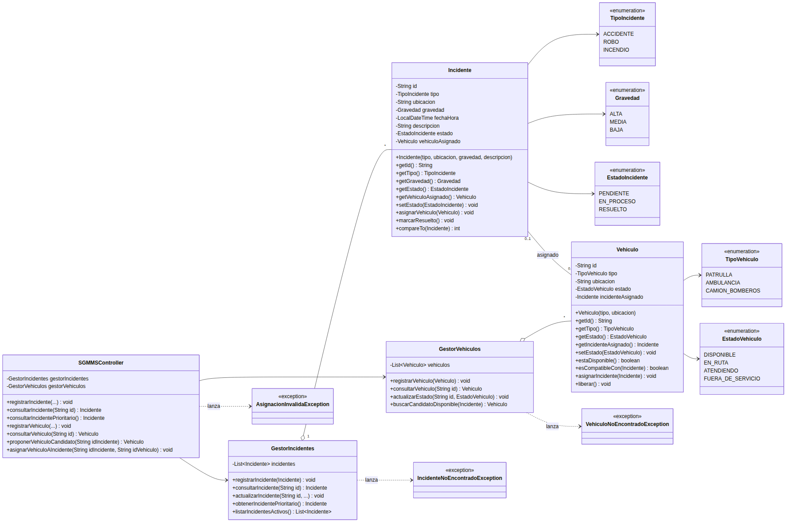

# Diagrama de clases — Paquete `model` (Entrega 1)

**Proyecto:** SGMMS — Tarea Integradora, Entrega 1 (Ingeniería de Software II)
**Equipo:** Yandriani Castañeda, Samuel Sepúlveda, Joshua García
**Elaborado en:** Visual Paradigm Professional (Joshua García — Universidad Icesi)

## Alcance

El diagrama corresponde **únicamente al paquete `model`**, incluyendo la clase
`Controller` (aquí `SGMMSController`), y cubre los cuatro requerimientos
funcionales de esta entrega (RF1–RF4). No incluye mapa, rutas, persistencia en
archivos ni concurrencia: se incorporarán en entregas posteriores.

> ⚠️ **Antes de subir esta entrega**, revisen con Joshua los puntos listados en
> la sección *"Consideraciones antes de entregar"* al final de este documento:
> son pequeños typos del diagrama que la rúbrica puede penalizar en el criterio
> de UML ("notación correcta, legible y organizado") si no se corrigen.

## Enumeraciones

| Enumeración | Valores | Usada por |
|---|---|---|
| `TipoIncidente` | `ACCIDENTE`, `ROBO`, `INCENDIO` | `Incidente` |
| `Gravedad` | `ALTA`, `MEDIA`, `BAJA` | `Incidente` (orden de prioridad: ALTA > MEDIA > BAJA) |
| `EstadoIncidente` | `PENDIENTE`, `EN_PROCESO`, `RESUELTO` | `Incidente` |
| `TipoVehiculo` | `PATRULLA`, `AMBULANCIA`, `CAMION_BOMBEROS` | `Vehiculo` |
| `EstadoVehiculo` | `DISPONIBLE`, `EN_RUTA`, `ATENDIENDO`, `FUERA_DE_SERVICIO` | `Vehiculo` |

## Clases del modelo

### `Incidente`
Representa un incidente registrado en el sistema (RF1) y provee el criterio de
comparación usado para priorizarlo (RF2).

**Atributos**
- `- id : String`
- `- tipo : TipoIncidente`
- `- ubicacion : String`
- `- gravedad : Gravedad`
- `- fechaHora : LocalDateTime`
- `- descripcion : String`
- `- estado : EstadoIncidente`
- `- vehiculoAsignado : Vehiculo`

**Métodos**
- `+ Incidente(tipo, ubicacion, gravedad, descripcion)` — constructor; genera el `id`, fija `fechaHora` al momento actual y `estado = PENDIENTE`.
- `+ getId() : String`
- `+ getTipo() : TipoIncidente`
- `+ getGravedad() : Gravedad`
- `+ getEstado() : EstadoIncidente`
- `+ getVehiculoAsignado() : Vehiculo`
- `+ setEstado(estado: EstadoIncidente) : void`
- `+ asignarVehiculo(vehiculo: Vehiculo) : void` — asocia el vehículo y cambia el estado a `EN_PROCESO` (RF4).
- `+ marcarResuelto() : void` — cambia el estado a `RESUELTO` (RF2).
- `+ compareTo(otro: Incidente) : int` — implementa `Comparable<Incidente>`; ordena por `gravedad` (ALTA > MEDIA > BAJA) y desempata por `fechaHora` (más antiguo primero) (RF2).

### `Vehiculo`
Representa un vehículo de atención (RF3) y valida su compatibilidad con un
incidente (RF4).

**Atributos**
- `- id : String`
- `- tipo : TipoVehiculo`
- `- ubicacion : String`
- `- estado : EstadoVehiculo`
- `- incidenteAsignado : Incidente`

**Métodos**
- `+ Vehiculo(tipo, ubicacion)` — constructor; genera el `id` y fija `estado = DISPONIBLE`.
- `+ getId() : String`
- `+ getTipo() : TipoVehiculo`
- `+ getEstado() : EstadoVehiculo`
- `+ getIncidenteAsignado() : Incidente`
- `+ setEstado(estado: EstadoVehiculo) : void`
- `+ estaDisponible() : boolean`
- `+ esCompatibleCon(incidente: Incidente) : boolean` — reglas: patrulla→robo/apoyo accidente, ambulancia→accidente, camión de bomberos→incendio (RF4).
- `+ asignarIncidente(incidente: Incidente) : void`
- `+ liberar() : void` — vuelve el vehículo a `DISPONIBLE` y limpia `incidenteAsignado`.

### `GestorIncidentes`
Encapsula la colección de incidentes y las operaciones de RF1 y RF2.

**Atributos**
- `- listaIncidentes : List<Incidente>`

**Métodos**
- `+ registrarIncidente(incidente: Incidente) : void`
- `+ consultarIncidente(id: String) : Incidente` — lanza `IncidenteNoEncontradoException` si no existe.
- `+ actualizarIncidente(id: String, ...) : void`
- `+ obtenerIncidentePrioritario() : Incidente`
- `+ listarIncidentesActivos() : List<Incidente>`

### `GestorVehiculos`
Encapsula la colección de vehículos y las operaciones de RF3, y apoya a RF4
proponiendo candidatos.

**Atributos**
- `- listaVehiculos : List<Vehiculo>`

**Métodos**
- `+ registrarVehiculo(vehiculo: Vehiculo) : void`
- `+ consultarVehiculo(id: String) : Vehiculo` — lanza `VehiculoNoEncontradoException` si no existe.
- `+ actualizarEstado(id: String, estado: EstadoVehiculo) : void`
- `+ buscarCandidatoDisponible(incidente: Incidente) : Vehiculo`

### `SGMMSController`
Clase de control (patrón MVC) que orquesta los casos de uso de esta entrega,
delegando en `GestorIncidentes` y `GestorVehiculos`.

**Atributos**
- `- gestorIncidentes : GestorIncidentes`
- `- gestorVehiculos : GestorVehiculos`

**Métodos**
- `+ getGestorIncidentes() : GestorIncidentes`
- `+ setGestorIncidentes(gestorIncidentes: GestorIncidentes) : void`
- `+ getGestorVehiculos() : GestorVehiculos`
- `+ setGestorVehiculos(gestorVehiculos: GestorVehiculos) : void`
- `+ registrarIncidente(...) : void`
- `+ consultarIncidente(id: String) : Incidente`
- `+ consultarIncidentePrioritario() : Incidente`
- `+ registrarVehiculo(...) : void`
- `+ consultarVehiculo(id: String) : Vehiculo`
- `+ proponerVehiculoCandidato(idIncidente: String) : Vehiculo`
- `+ asignarVehiculoAIncidente(idIncidente: String, idVehiculo: String) : void` — valida disponibilidad y compatibilidad; si la asignación no es válida lanza `AsignacionInvalidaException`.

### Excepciones del dominio
- `IncidenteNoEncontradoException` — se lanza cuando se consulta/actualiza un `id` de incidente inexistente.
- `VehiculoNoEncontradoException` — se lanza cuando se consulta/actualiza un `id` de vehículo inexistente.
- `AsignacionInvalidaException` — se lanza cuando se intenta asignar un vehículo no disponible, incompatible, o a un incidente ya resuelto/con vehículo asignado.

## Relaciones y multiplicidades

| Origen | Relación | Destino | Multiplicidad |
|---|---|---|---|
| `SGMMSController` | asociación (usa) | `GestorIncidentes` | 1 → 1 |
| `SGMMSController` | asociación (usa) | `GestorVehiculos` | 1 → 1 |
| `GestorIncidentes` | agregación | `Incidente` | 1 → 0..* |
| `GestorVehiculos` | agregación | `Vehiculo` | 1 → 0..* |
| `Incidente` | asociación (`vehiculoAsignado` / `incidenteAsignado`) | `Vehiculo` | 0..1 → 0..1 |
| `Incidente` | dependencia | `TipoIncidente`, `Gravedad`, `EstadoIncidente` | — |
| `Vehiculo` | dependencia | `TipoVehiculo`, `EstadoVehiculo` | — |
| `GestorIncidentes` | dependencia (lanza) | `IncidenteNoEncontradoException` | — |
| `GestorVehiculos` | dependencia (lanza) | `VehiculoNoEncontradoException` | — |
| `SGMMSController` | dependencia (lanza) | `AsignacionInvalidaException` | — |

## Trazabilidad requerimiento → clases/métodos

| Requerimiento | Clases / métodos responsables |
|---|---|
| RF1 – Gestionar incidentes | `Incidente` (constructor, getters, `setEstado`), `GestorIncidentes` (`registrarIncidente`, `consultarIncidente`, `actualizarIncidente`), `SGMMSController` (métodos equivalentes) |
| RF2 – Gestionar la prioridad de los incidentes | `Incidente.compareTo`, `GestorIncidentes.obtenerIncidentePrioritario`, `Incidente.marcarResuelto`, `SGMMSController.consultarIncidentePrioritario` |
| RF3 – Gestionar vehículos de atención | `Vehiculo` (constructor, getters, `setEstado`, `estaDisponible`), `GestorVehiculos` (`registrarVehiculo`, `consultarVehiculo`, `actualizarEstado`) |
| RF4 – Asignar vehículos a incidentes | `Vehiculo.esCompatibleCon`, `GestorVehiculos.buscarCandidatoDisponible`, `Incidente.asignarVehiculo`, `Vehiculo.asignarIncidente`, `SGMMSController.proponerVehiculoCandidato`, `SGMMSController.asignarVehiculoAIncidente`, `AsignacionInvalidaException` |

---

## Consideraciones antes de entregar

La versión actual del diagrama en Visual Paradigm (imagen de arriba) tiene
algunos detalles menores que conviene corregir directamente ahí antes de subir
la entrega definitiva — el texto de este documento ya asume los nombres
correctos, pero **el diagrama todavía no**:

1. **Atributos de las colecciones**: en `GestorVehiculos` el atributo aparece
   como `LiistVehiculos` y en `GestorIncidentes` como `ListIncidente`. Deberían
   ser `listaVehiculos : List<Vehiculo>` y `listaIncidentes : List<Incidente>`
   respectivamente (nombre en minúscula inicial + tipo genérico visible).
2. **Método de actualización de incidentes**: aparece como
   `actualization(String id) : void`. Debería llamarse `actualizarIncidente` y
   recibir los datos a actualizar, igual que `actualizarEstado` en
   `GestorVehiculos`.
3. **Nombres de get/set del Controller**: aparecen como `getGestorincidentes`
   / `setGestorincidentes` / `getGestorvehiculos` / `setGestorvehiculos` (con
   minúscula donde debería ir mayúscula: `GestorIncidentes`,
   `GestorVehiculos`), y el tipo de los atributos también aparece en minúscula
   (`Gestorincidentes`, `Gestorvehiculos`). Deben coincidir exactamente con el
   nombre de la clase (`GestorIncidentes`, `GestorVehiculos`).
4. **Método `registrarIncident()`**: le falta la "e" final — debería ser
   `registrarIncidente(...)`, y debería llevar los parámetros del incidente a
   registrar (igual que `registrarVehiculo`).
5. **Método `ConsultarIncidente`**: empieza con mayúscula, debería ser
   `consultarIncidente` (los demás métodos siguen la convención camelCase con
   minúscula inicial), y su tipo de retorno debe ser `Incidente` (con
   mayúscula, es el nombre de la clase).
6. **Nombre de la excepción de incidentes**: `IncidenteNoEncontradoException`
   usa el sufijo en inglés "Exception", mientras que las otras dos
   (`AsignacionInvalidaExcepcion`, `VehiculoNoEncontradoExcepcion` en el
   diagrama) usan "Excepcion" en español. Elijan un solo idioma para el sufijo
   y aplíquenlo a las tres clases de excepción (este documento usa
   `...Exception` en las tres, siguiendo la convención de Java).

Ninguno de estos puntos cambia el diseño ni la trazabilidad con los
requerimientos — son ajustes de ortografía/nomenclatura en Visual Paradigm
para que el diagrama sea coherente consigo mismo y con el resto de la entrega.
